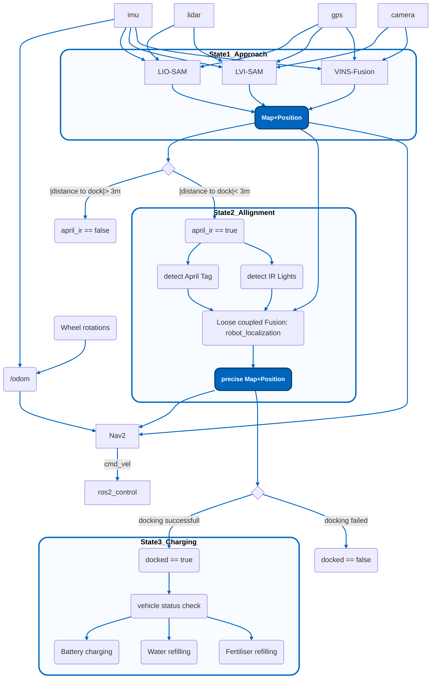

```mermaid
graph TD
    imu --> odom(/odom)
    lidar --> LIO-SAM
    gps --> LIO-SAM
    imu --> LIO-SAM

    imu --> LVI-SAM
    gps --> LVI-SAM
    camera --> LVI-SAM
    lidar --> LVI-SAM

    imu --> VINS-Fusion
    gps --> VINS-Fusion
    camera --> VINS-Fusion

    subgraph State1_Approach_
        map 
        LVI-SAM
        LIO-SAM
        VINS-Fusion
    end 

    subgraph State2_Allignment_
        o_1 --> april(detect April Tag)
        o_1 --> ir(detect IR Lights)
        ir --> late_fusion(Loose coupled Fusion: robot_localization)
        april --> late_fusion
        late_fusion --> map_2(precise Map+Position)
    end


    LVI-SAM --> map(Map+Position)
    LIO-SAM --> map(Map+Position)
    VINS-Fusion --> map(Map+Position)

    map(Map+Position):::tumBlue

    map(Map+Position)-->check{ }
    map --> late_fusion
    

    check --|distance to dock|> 3m --> o_2(april_ir == false)
    check --|distance to dock|< 3m --> o_1(april_ir == true)
    
    map_2:::tumBlue

    
    wheel(Wheel rotations) -->odom
    odom-->Nav2
    map --> Nav2

    map_2 --> Nav2

    Nav2 --cmd_vel--> ros2_control

    map_2 ---> check_2{ }
    check_2 --docking successfull --> o_3(docked == true)
    check_2 --docking failed --> o_4(docked == false)
    subgraph State3_Charging_
        o_3-->status_check(vehicle status check)
        status_check --> charge_b(Battery charging)
        status_check --> charge_w(Water refilling)
        status_check --> charge_f(Fertiliser refilling)
    end

    %%%%%%%%%%%%%%%%%%%%%%%%%%%%%%%%%%%%%%%%%%%%%%%%%%%%%%%%%%%%%%%%%%%%%%%%%%%%%%%%%%%%


    click LIO-SAM "https://github.com/TixiaoShan/LIO-SAM/tree/ros2"
    click VINS-Fusion "https://github.com/HKUST-Aerial-Robotics/VINS-Fusion"
    click LVI-SAM "https://github.com/TixiaoShan/LVI-SAM"


    %%%%%%%%%%%%%%%%%%%%%%%%%%%%%%%%%%%%%%%%%%%%%%%%%%%%%%%%%%%%%%%%%%%%%%%%%%%%%%%%%%%%

    %% === Styles ===
    %% TUM Farben und modernes Design für alle Diagramme
    %% --- BASIS-STYLES ---
    classDef tumBlue fill:#0065BD,stroke:#003359,stroke-width:2px,color:#ffffff,rx:12,ry:12,font-size:14px,font-weight:bold;

    classDef tumLightBlue fill:#64A0C8,stroke:#003359,stroke-width:2px,color:#ffffff,rx:12,ry:12,font-size:14px,font-weight:bold;

    classDef tumOrange fill:#E87722,stroke:#B85A1A,stroke-width:2px,color:#ffffff,rx:12,ry:12,font-size:14px,font-weight:bold;

    classDef tumGreen fill:#A2AD00,stroke:#7A8500,stroke-width:2px,color:#ffffff,rx:12,ry:12,font-size:14px,font-weight:bold;

    %% --- SUBGRAPH-STYLES ---
    style State2_Allignment_ fill:#F8FBFF,stroke:#0065BD,stroke-width:3px,rx:20,ry:20,color:#000000,font-size:16px,font-weight:bold;

    style State1_Approach_ fill:#F8FBFF,stroke:#0065BD,stroke-width:3px,rx:20,ry:20,color:#000000,font-size:16px,font-weight:bold;

    style State3_Charging_ fill:#F8FBFF,stroke:#0065BD,stroke-width:3px,rx:20,ry:20,color:#000000,font-size:16px,font-weight:bold;


    %% Alle Verbindungen einheitlich stylen
    linkStyle default stroke:#0065BD,stroke-width:2px;


```
