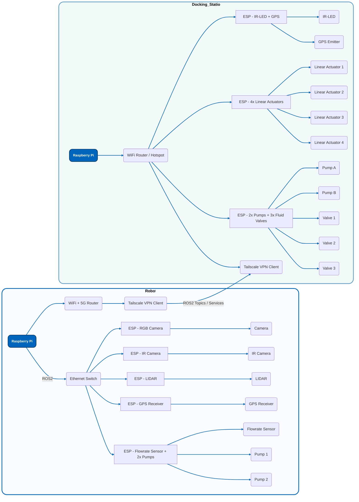

# Diagram of the Datasystem

## Phsyical Connection of Sensors: 

## ROS2 connection of sensors

### Nodes
A Node is an executable program that performs a specific task. Think of each node as a small, independent specialist. You'll have nodes on both the robot and the docking station.

### Topics
A Topic is like a radio channel where nodes can publish (broadcast) messages. Other nodes can subscribe (listen) to these topics to get the data. Topics are for continuous data streams.

###  Services and Actions
While Topics are for continuous data, Services are for request/response interactions (like a function call). Actions are for long-running tasks where you need feedback.

